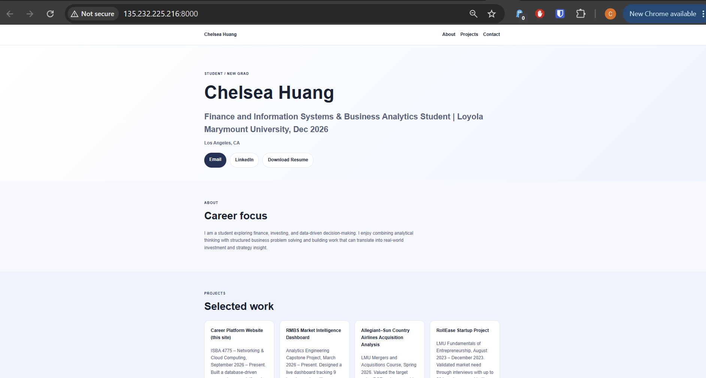

# Exercise 03 evidence: build it, then move it

## Documents

| Document | Where | Commit | Order |
|---|---|---|---|
| Spec | [`docs/resume-platform-spec.md`](../resume-platform-spec.md) | `de01067` (2026-09-15) "Add project docs and implementation plan" | Before the app code in `dc6fc58` (2026-09-17) |
| Implementation plan | [`docs/implementation-plan.md`](../implementation-plan.md) | `de01067` (2026-09-15) | Before the app code in `dc6fc58` (2026-09-17) |
| Migration plan, with results | [`docs/superpowers/plans/2026-09-24-azure-vm-migration.md`](../superpowers/plans/2026-09-24-azure-vm-migration.md) | Written 2026-09-24, run 2026-09-29 and 2026-10-01 | Verify results table, Two locks, and the profile re-run are at the end |

The spec and implementation plan were written before the `docs/superpowers/` folders existed in this repo, so they sit directly in `docs/`. I left them there instead of moving them, because a move would add a new commit dated after the app code, and the commit history is what shows they came first (`git log --follow docs/resume-platform-spec.md`).

## 1. The VM

| | |
|---|---|
| Name | `vm-career-platform` |
| Resource group | `rg-career-platform` |
| Region | North Central US (`northcentralus`) |
| Size | `Standard_B2ats_v2` |
| Image | Ubuntu Server 24.04 LTS |
| Public IP | `135.232.225.216` (Static) |
| Firewall (inbound) | `Allow-SSH-Laptop`: TCP 22 from my laptop's address only (`/32`). No rule for 8000 except during the screenshot. |
| App | uvicorn on `127.0.0.1:8000`, started with `nohup`, reading `data/career_platform.db` |

## 2. My site on the public IP

Taken 2026-10-01 at 12:06 PM, while `Temp-HTTP-8000` was open and the app listened on `0.0.0.0:8000`. Both were closed again right after: the public URL then timed out. The browser's bookmarks bar was cropped out of the screenshot for privacy; nothing else was changed.

## 3. What went wrong, how I investigated, and what confirmed the fix

### The guide's region wasn't allowed on my student subscription

- **What happened:** the guide says to create the VM in (US) West US 2, but that region didn't work on my Azure for Students subscription, so I had to pick a different one.
- **How we investigated:** `az policy assignment list` shows a policy on my subscription named "Allowed resource deployment regions". It only permits `westus`, `northcentralus`, `canadacentral`, `mexicocentral` and `swedencentral`, and West US 2 (`westus2`) isn't one of them. The activity log has no failed deployment, because the portal blocks a disallowed region before anything is created.
- **Fix:** I created the VM in North Central US (`northcentralus`), which is on the allowed list.
- **What confirmed it:** the deployment succeeded on 2026-09-24 (`CreateVirtualMachine-vm-career-platform`: `Succeeded`), and `az vm show` reports the region as `northcentralus`.
- **In my own words:** The class guide used West US 2, but student subscriptions only allow a few regions, and West US 2 isn't one of them, so Azure wouldn't let me create the VM there. I checked the subscription's policy, saw which regions were allowed, and picked North Central US instead. The VM deployed successfully there, and the region doesn't change how the app runs, only where the server physically sits.

### The migrated data was demo data, and the seed would have brought it back

- **What happened:** the first migration (2026-09-29) copied a database that still held the demo profile and projects the seed creates. Every check passed, but a freshly seeded database would have passed them too. When I replaced the demo projects with mine, the app's `init_db()` would have re-inserted the 3 demo projects on the next start, because it added any demo title that was missing.
- **How we found it:** reading `database.py` before writing my data.
- **Fix:** test-first. `test_init_db_does_not_add_demo_projects_next_to_real_ones` failed (the demo titles came back), then passed after the change in `71cd1ec` (seed only an empty table). 6/6 tests pass. Tests now run against a temporary folder, so they can't change my real database.
- **What confirmed it:** after copying my database to the VM and restarting, the page showed my email and 4 projects, **0** demo titles, the database fingerprint (`f27e4d51…`) matched my laptop's and didn't change on startup, and the log had 0 fallback lines.
- **In my own words:** My first migration "worked", but it only proved the demo data moved, which a fresh seed would have shown anyway. When I went to put my real profile in, we found the startup code would quietly add the demo projects back. We wrote a test that showed the bug first, fixed the code, and then checked the VM: my email and projects were on the page, no demo projects, and the database fingerprint matched my laptop's exactly. That fingerprint is what proves the file actually moved.

### SSH hung when I was off campus

- **What happened:** on 2026-10-01, from home, `ssh` to the VM failed with `Connection timed out`.
- **How we investigated:** the VM was deallocated (auto-shutdown), and `az network nsg rule list` showed `Allow-SSH-Laptop` only allows my campus address. My laptop's public address at home was different, so the firewall dropped the connection before it reached the VM. `az` still worked, because it talks to Azure, not through the VM's firewall.
- **What confirmed it:** back on campus, with the same rule, SSH connected immediately after `az vm start`.
- **In my own words:** When I tried to connect from home, SSH just hung. A hang means something is dropping the request, not that the login failed. The firewall rule only lets in my campus IP address, and at home my laptop has a different one. Once I was back on campus, the same command connected right away, which confirmed it was the firewall and not the VM.

### `az` said my resource group didn't exist

- **What happened:** the first `az vm get-instance-view` failed with `ResourceGroupNotFound`.
- **How we investigated:** `az account list` showed two subscriptions. The CLI's default was an empty one; the VM is in "Azure for Students".
- **What confirmed the fix:** with `--subscription "Azure for Students"`, the same command returned the VM's power state.
- **In my own words:** My Azure account has two subscriptions, and the CLI was looking in the wrong one by default, so it said my resource group didn't exist. Listing the subscriptions showed the VM was under "Azure for Students". Adding that subscription to the command fixed it.

### The agent's process check matched itself

- **What happened:** starting uvicorn, the agent's guard reported "ALREADY RUNNING" twice, though nothing was running.
- **How we investigated:** `pgrep -a -f "[u]vicorn"` and `ss -ltn` showed no server and nothing on port 8000. The match was the SSH command's own text, which contained "uvicorn career_platform". The plan's `pkill -f` stop command had the same flaw and would have killed its own SSH session.
- **Fix:** start and stop now find the server by the port it owns (`ss -ltnp | grep :8000`).
- **What confirmed it:** the restart worked, and later the port-based stop freed port 8000 cleanly every time.
- **In my own words:** The agent's check for "is the app already running?" searched for any process whose command mentioned uvicorn, and it found its own command. So it reported the app was running when it wasn't. We confirmed nothing was listening on port 8000, then switched to checking the port itself, which is what actually matters.

### The agent claimed something it hadn't checked

- **What happened:** the agent's plan said port 8000 was "never opened in the NSG". It hadn't read the rules; `Temp-HTTP-8000` (source Any) was open from the two-lock exercise.
- **How it was caught:** when `http://135.232.225.216:8000` didn't load, the agent read the rules with `az network nsg show` and corrected the plan (see its "Two locks" section).
- **In my own words:** The agent wrote in my plan that port 8000 had never been opened, but it hadn't actually checked, and I had opened it for the two-locks exercise. Reading the real firewall rules showed the mistake, and the plan was corrected. It reminded me to check the agent's claims against real output instead of trusting the plan's wording.

## 4. The change

> You're at a coffee shop and try to SSH into your VM to fix a typo. The command hangs.

The SSH firewall rule only allows my campus IP address, and the coffee shop gives my laptop a different one, so Azure drops the connection and SSH hangs instead of saying "permission denied". I'd use the portal or `az`, which still work because they go through Azure and not port 22, to change the rule's source to the coffee shop's address with `/32` (never Any), fix the typo, and then switch the rule back. It costs a few minutes and a firewall change every time I'm on a new network, and while the rule is open, anyone sharing that Wi-Fi address could try to connect, although they'd still need my private key.
